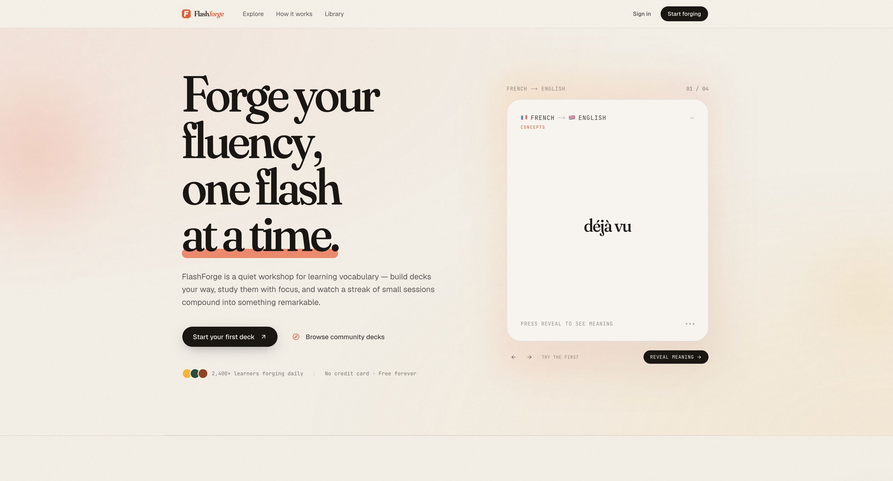
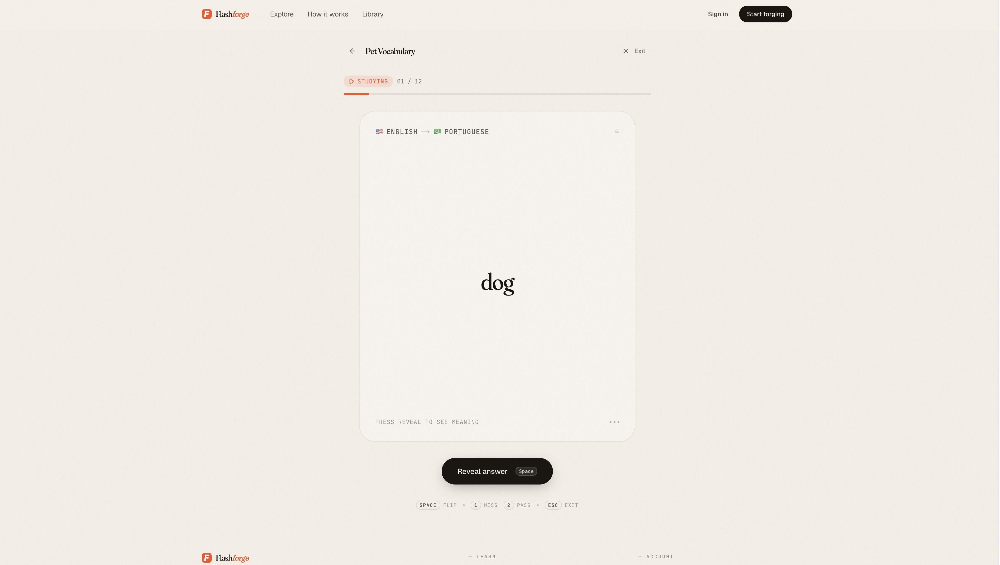
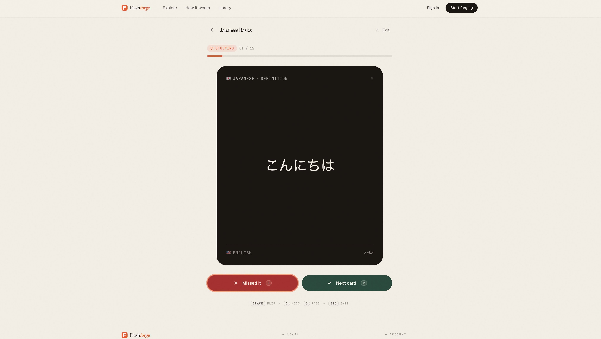
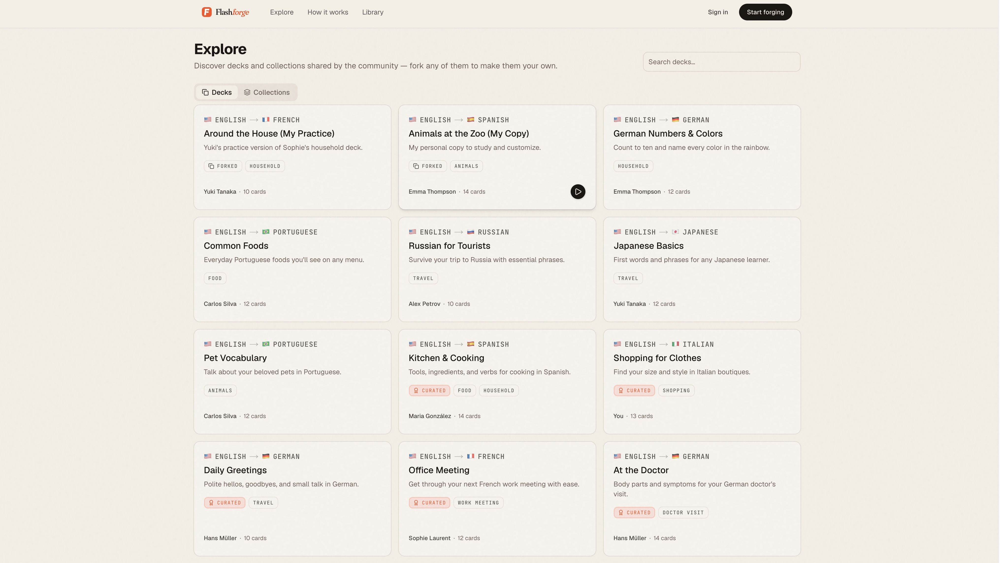
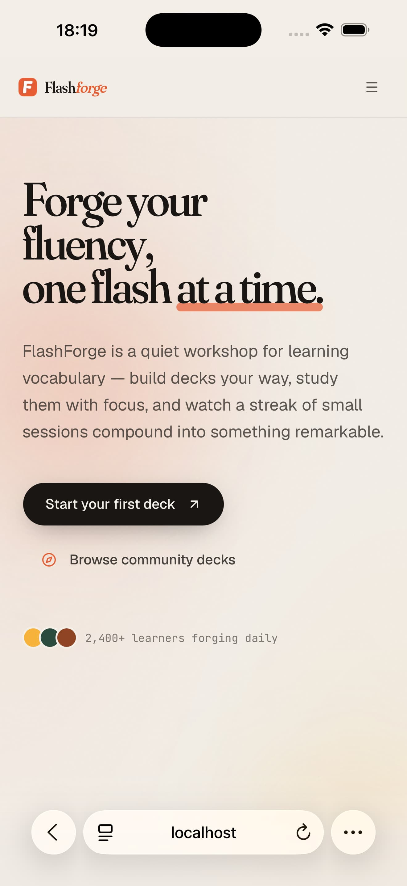
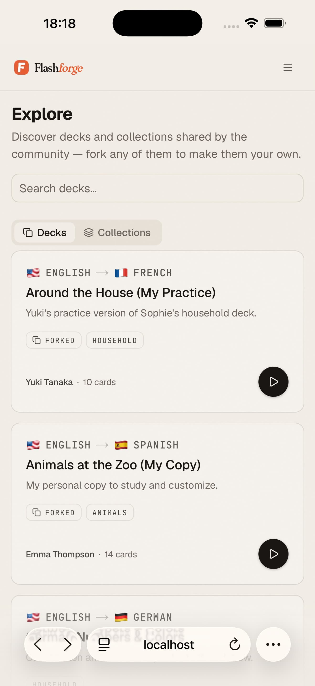
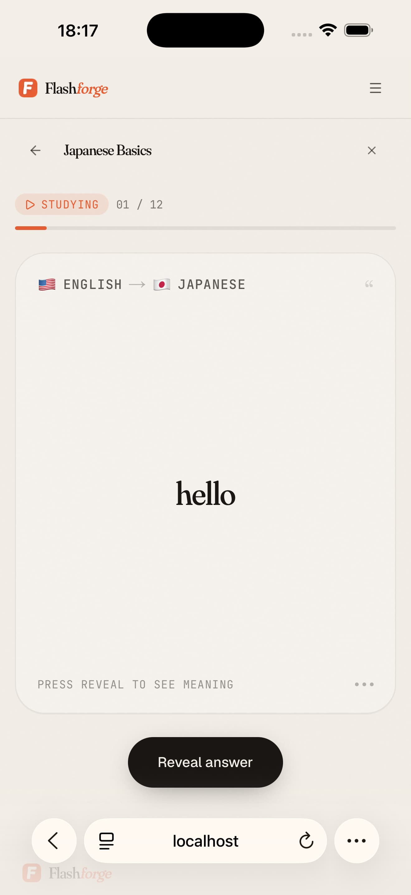
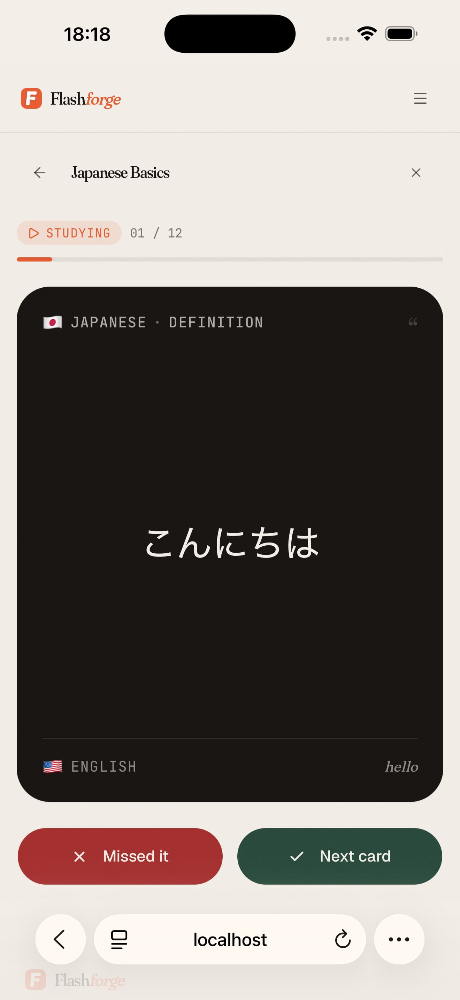

<div align="center">


# FlashForge

### Forge your fluency, one flash at a time.

Build a vocabulary habit with focused flashcard sessions, useful community decks, and progress that rewards consistency.

[**Start learning →**](https://flashforge.denyspupin.dev) · [Explore decks](https://flashforge.denyspupin.dev/explore) · [See how it works](#a-simple-daily-loop)

[](./LICENSE)
[](https://github.com/denyspupin/flashforge/actions/workflows/ci.yml)

</div>

<p align="center">
  
</p>

## Learn words. Keep the habit.

FlashForge is a calm place to build and study vocabulary. Make a deck for the words you actually need, pick up a community deck, or organise several decks into a collection. Then study one card at a time—without an endless feed or distracting prompts.

Your sessions are saved as you go, so a short break never means losing your place. XP, streaks, and achievements make steady practice feel visible without turning a missed day into a punishment.

**[Try FlashForge →](https://flashforge.denyspupin.dev)**

## What you can do

- **Create decks for any language pair.** Add cards individually, add them in bulk, or import a deck you already have.
- **Study without losing momentum.** Flip cards, mark your answer, revisit misses, and resume a session whenever you return.
- **Find a useful starting point.** Browse public decks and curated collections; study them as a guest or fork them to tailor them to yourself.
- **See your effort add up.** Earn XP, build a daily streak, and unlock achievements through regular practice.
- **Make it yours.** Keep decks private or share them with the community, and choose light, dark, or system theme.

## A simple daily loop

### 1. Pick a real-world goal

Build a deck around the vocabulary you need next—travel, food, work, or a topic all your own. Every deck keeps its language pair and topic in one clear place.

### 2. Study one card at a time

Reveal the answer, rate your recall, and review the cards that need another pass. The experience stays focused from the first card to the final summary.

<p align="center">
  
  
</p>

### 3. Return tomorrow

One card is enough to keep a streak alive. Longer streaks increase XP, but the point is not perfection—it is making vocabulary practice easy to come back to.

## Learn from the library

Public decks are open to browse and study, even before you create an account. When you find one worth keeping, fork it into your own workspace and edit it freely. Collections bundle related decks so you can take on a larger theme without starting from a blank page.

<p align="center">
  
</p>

## Take your practice with you

FlashForge adapts naturally to smaller screens, so you can build a deck or fit in a quick review wherever you are.

<p align="center">
  
  
</p>

<p align="center">
  
  
</p>

## For contributors

FlashForge is built with Next.js, React, PostgreSQL, Drizzle, Clerk, and Tailwind CSS. For the complete local setup, environment variables, database workflow, and test guidance, read the [developer guide](./docs/DEVELOPER.md).

Quick start:

```bash
corepack enable
pnpm install --frozen-lockfile
cp .env.example .env.local
docker compose up -d && pnpm db:migrate && pnpm dev
```

The app will be available at <http://localhost:3000>. You will need Clerk credentials in `.env.local`; see the [developer guide](./docs/DEVELOPER.md) for details.

## Project links

- [Live app](https://flashforge.denyspupin.dev)
- [Architecture and API](./docs/PROJECT.md)
- [Contributing](./CONTRIBUTING.md)
- [Security policy](./SECURITY.md)
- [MIT License](./LICENSE)

<div align="center">

<sub>Built with care, one card flip at a time.</sub>

</div>
