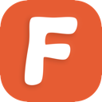
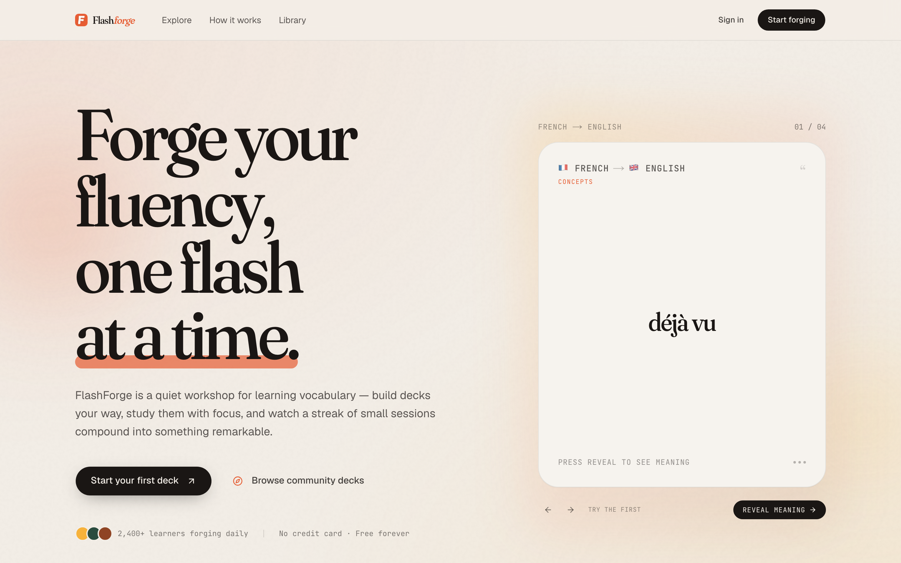
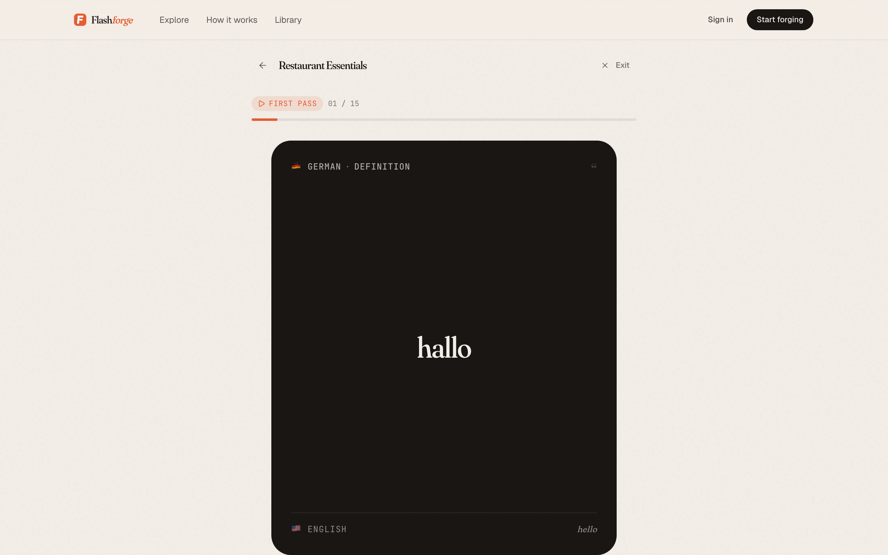
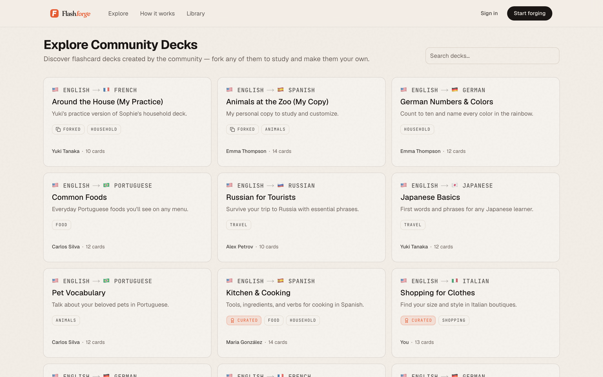
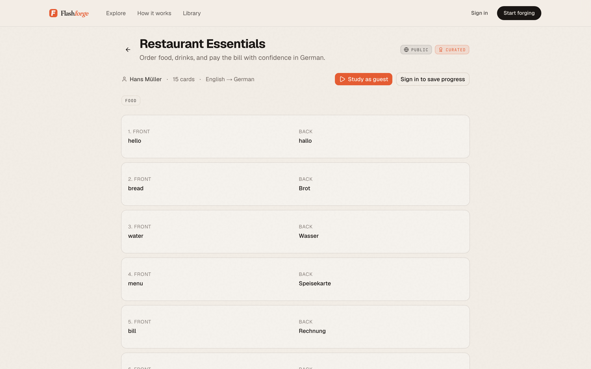

# FlashForge

### *Forge your fluency, one flash at a time.*

A quiet workshop for learning vocabulary — build flashcard decks your way, study them with focus, and watch a streak of small sessions compound into something remarkable.

[**Start forging →**](https://flashforge.app) · [Browse the library](#explore-the-library) · [How it works](#how-it-works)

---

  

---

## What is FlashForge?

FlashForge is a vocabulary learning platform built around flashcard decks, study sessions, and a streak system that rewards **showing up** instead of grinding.

You build decks organized by language pairs (English → German, Spanish → Japanese, anything) and topics (Food, Travel, Doctor Visit, …). You study them one card at a time — no scrolling, no flashcard fatigue, no notifications begging you back. Sessions save themselves, so you can step away and pick up exactly where you left off.

Whether you write your own decks or fork one from the community, the loop is the same: **a small, focused ritual you can actually keep.**

> No streaks-as-shaming. No notifications begging. Just a small loop that rewards showing up.

---

## How it works

Three quiet rituals, every day.

### 1 · Compose your deck
Pair any two languages. Add cards one at a time, paste a list, or fork a deck the community has already polished. Every deck is yours to shape.

### 2 · Study with focus
One card. No scroll. Flip, self-assess, and retry the ones that miss. Sessions save themselves — step away and return to exactly where you left off.

### 3 · Stack the small wins
XP for cards reviewed, multipliers for streaks that hold. A daily practice that asks for ten minutes, but rewards a lifetime of vocabulary.

  

---

## Explore the library

The community has built decks across **nine languages** and dozens of real-world topics. Browse, study any deck as a guest, or **fork** one into your own account to make it your own.

Every deck has a clear language pair, the topics it belongs to, who built it, and how many cards it has. Curated decks are highlighted by trusted community members.

  

---

## Anatomy of a deck

Each deck has a title, description, a language pair, the topics it belongs to, and the cards inside. Public decks are open to the world; private decks live only in your account. You can flip visibility whenever you want.

  

---

## XP that compounds, streaks that reward patience

A day-one session earns what a day-one session should. A thirty-day streak earns three times that. The numbers reward the thing you actually want to build: **a habit that sticks.**

| Streak | Multiplier | Vibe |
| --- | --- | --- |
| 1 day | ×1 | Warm-up |
| 3 days | ×1.5 | Gaining |
| 7 days | ×2 | Locked in |
| 14 days | ×2.5 | On fire |
| 30 days | ×3 | Forged |

> **A streak is a sentence — not a chain.** One card keeps it alive. There is no penalty for missing a day; there is only a quiet loss of the multiplier. The fire returns the moment you do.

---

## Topics in the workshop

Every topic is a doorway — build it out in any direction the language takes you. A single deck can belong to multiple topics at once (*"Restaurant Essentials"* spans **Food** + **Shopping**; *"Fruits & Vegetables"* lives across both).

**Food** · **Animals** · **Household** · **Work Meeting** · **Doctor Visit** · **Travel** · **Shopping** · *…and more, all the time.*

---

## For curious learners

- **Free forever** — no credit card, no ads, no premium tier.
- **Open library** — every public deck is browseable, forkable, and studyable as a guest.
- **Resumable sessions** — start a deck, walk away, come back to the same card.
- **One retry round** — failed cards come back for a second pass so you actually learn them.
- **Notifications for the good stuff** — get a quiet ping when someone forks your deck or you unlock an achievement.

---

## For builders

If you'd like to set up the project locally, check out the developer documentation:

- [`docs/DEVELOPER.md`](docs/DEVELOPER.md) — installation, scripts, and the developer quickstart
- [`docs/PROJECT.md`](docs/PROJECT.md) — full architecture, schema, and API reference
- [`AGENTS.md`](AGENTS.md) — agent-facing summary and conventions

The project is built with **Next.js 16**, **React 19**, **PostgreSQL + Drizzle**, **Clerk** for auth, **Tailwind 4** + **shadcn/ui**, and lives on **Vercel**.

---

## License

Private — not currently licensed for redistribution.

Built with care. Two card flips at a time.

